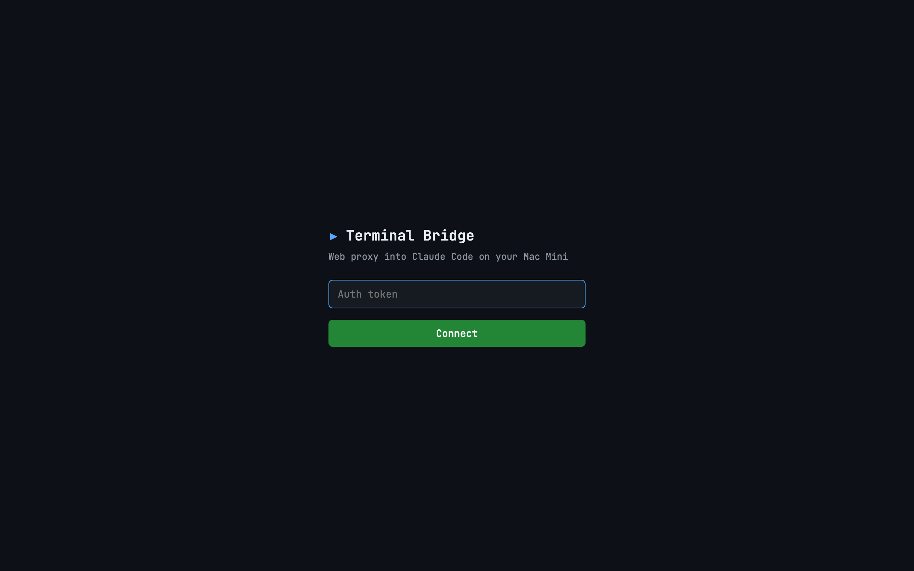
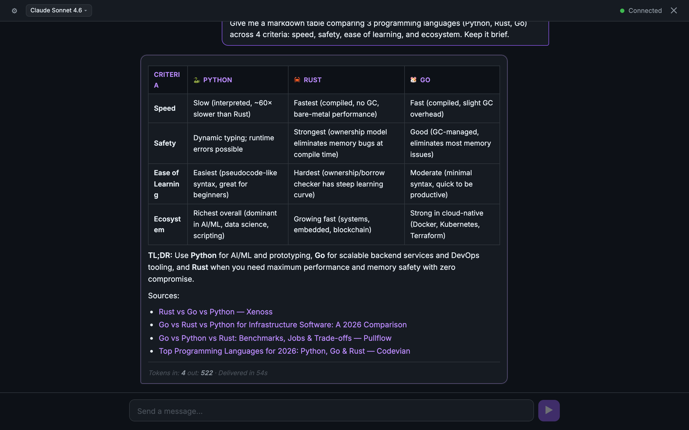
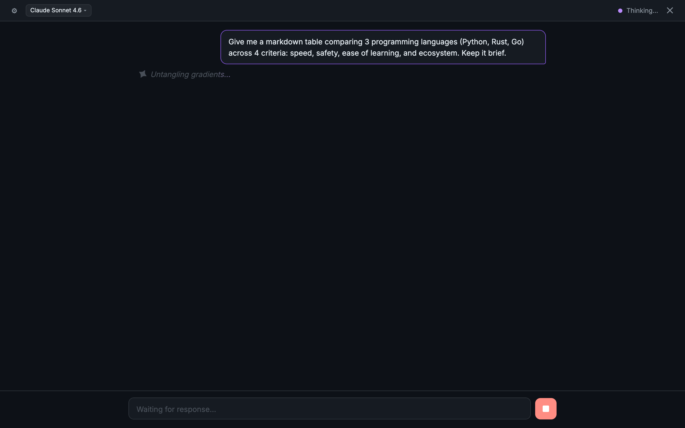
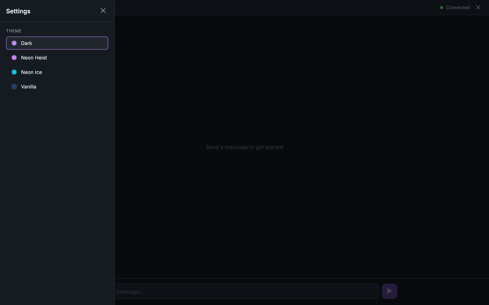
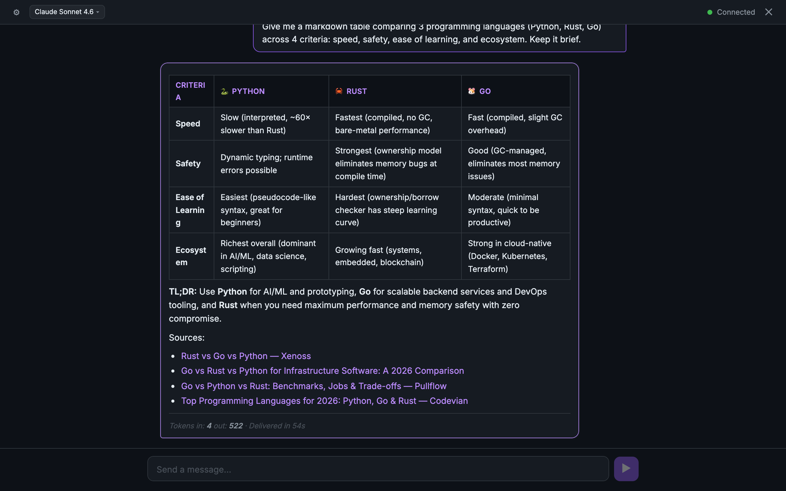
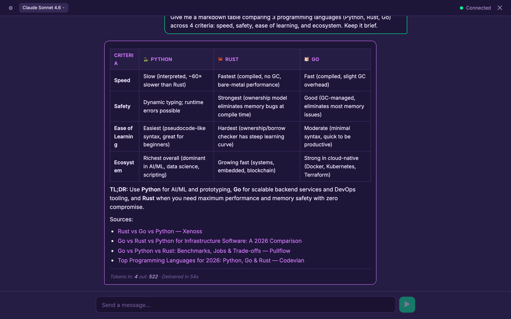
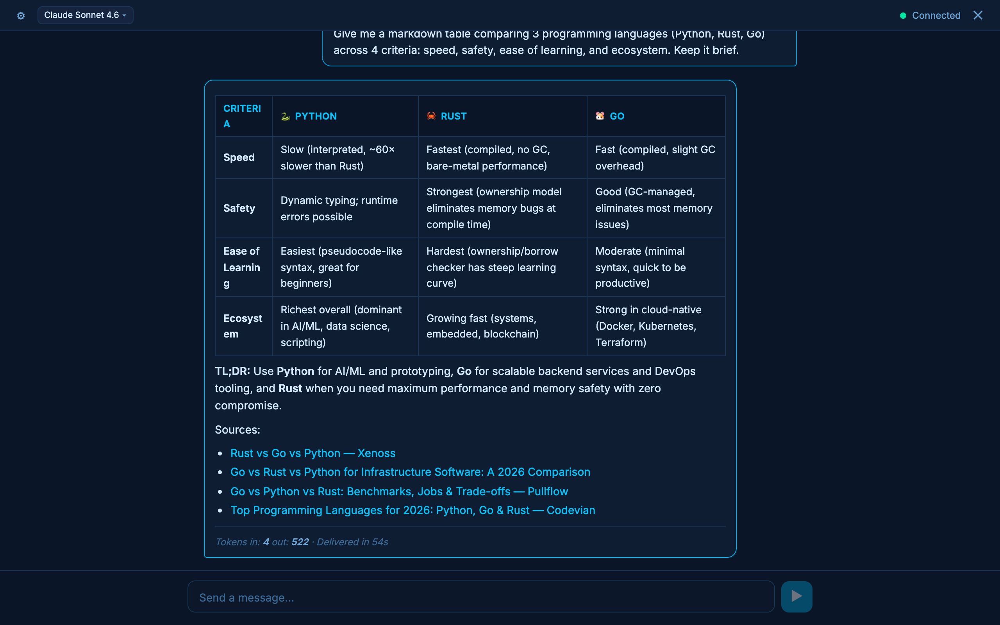
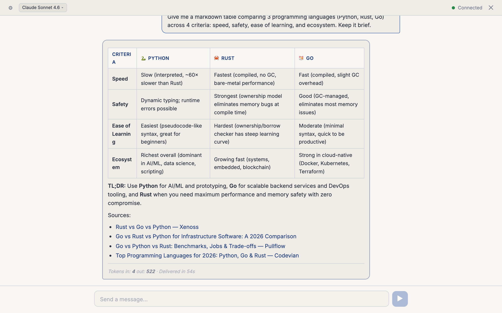

# Terminal Bridge

Bridge the gap between your browser and your machine's command line. Access a full terminal session and an AI chat interface from anywhere over the web.

Terminal Bridge runs on a Mac Mini (or any macOS/Linux host) and exposes two browser-based clients through a single server:

- **Terminal Client** — A full xterm.js terminal connected to a persistent tmux session
- **AI Chat Client** — A ChatGPT-style interface powered by the Claude Agent SDK with tool use, streaming, and themes

Both clients authenticate via a shared token and reconnect automatically on connection loss.

---

## Features

### Login

Both clients authenticate with a shared token. Set `TERMINAL_BRIDGE_AUTH_TOKEN` in the client-ai `.env` file to auto-connect and bypass this screen.



### Web Terminal

- Full xterm.js terminal with WebGL rendering
- Persistent tmux sessions that survive disconnects
- Binary WebSocket protocol for low-latency I/O
- Mobile-friendly key bar (Ctrl, Alt, Tab, arrow keys, Esc)
- Auto-resize to browser viewport
- Exponential backoff reconnection (1s → 30s)

### AI Chat

- Stream responses from Claude with real-time text, thinking, and tool use
- Full markdown rendering — tables, code blocks, headings, lists, blockquotes, links
- Syntax highlighting in code blocks (highlight.js, github-dark theme)
- Model switching at runtime (Opus 4.6, Sonnet 4.6, Haiku 4.5)
- Tool use blocks with expandable input/output and duration
- Thinking blocks with collapsible internal reasoning
- Permission request dialogs for tool authorization
- Interrupt/stop button for in-flight queries



### Animated Thinking Indicator

While the AI is processing, an animated indicator appears inline in the chat area (where the response will eventually stream in):

- Spinning sparkle star with shimmer gradient
- Cycling through 155+ humorous keyword phrases ("Consulting the void...", "Tickling tensors...", "Collapsing wavefunctions...")
- Text uses a shimmer animation matching the theme's accent color



### Settings Panel

Slide-over panel from the left, triggered by the gear icon in the header. Contains the theme selector. Closes on overlay click or Escape key.



### Theme System

Four built-in themes, all using CSS custom properties. Theme persists across sessions via localStorage.

| Theme | Preview |
|-------|---------|
| **Dark** (default) — Deep charcoal with purple accents |  |
| **Neon Heist** — Deep purple with magenta/neon green |  |
| **Neon Ice** — Deep navy with electric blue |  |
| **Vanilla** — Light cream with navy accents |  |

---

## Architecture

```
┌─────────────┐     ┌─────────────┐
│  Terminal   │     │  AI Chat    │
│  Client     │     │  Client     │
│  (xterm.js) │     │  (React)    │
└──────┬──────┘     └──────┬──────┘
       │ binary WS /ws     │ JSON WS /ws-ai
       │                   │
┌──────┴───────────────────┴──────┐
│         Express Server          │
│    (single HTTP + upgrade)      │
├─────────────┬───────────────────┤
│  Terminal   │    AI Connection  │
│  Handler    │    Handler        │
│  ↕ node-pty │    ↕ Provider     │
│  ↕ tmux     │    ↕ Claude SDK   │
└─────────────┴───────────────────┘
```

### Monorepo Layout

```
terminal-bridge/
├── client/        # Terminal client (React + xterm.js + Vite)
├── client-ai/     # AI chat client (React + Vite)
├── server/        # Express + dual WebSocket server
├── shared/        # Protocol types shared by all packages
├── docs/          # Design documents
└── package.json   # Root workspace scripts
```

### Provider Architecture (SOLID)

The AI backend uses a Strategy pattern. Adding a new AI provider requires:

1. Extend the `AgentProvider` abstract class
2. Implement the async generator `query()` method
3. Register in `server.ts`

No changes to the handler, protocol, or client are needed.

---

## Quick Start

### Prerequisites

- **Node.js** 22+ and npm
- **macOS** with tmux (`brew install tmux`)
- **Anthropic API key** (`ANTHROPIC_API_KEY` env var)

### Setup

```bash
# Clone the repo
git clone <repo-url> terminal-bridge
cd terminal-bridge

# Install dependencies (root + all packages)
npm install
cd client && npm install && cd ..
cd client-ai && npm install && cd ..
cd server && npm install && cd ..

# Set your auth token
export TERMINAL_BRIDGE_AUTH_TOKEN="your-secret-token"

# Set your Anthropic API key
export ANTHROPIC_API_KEY="sk-ant-..."

# Create client-ai .env for auto-connect (optional)
echo "TERMINAL_BRIDGE_AUTH_TOKEN=your-secret-token" > client-ai/.env

# Build everything
npm run build

# Start the server
npm start
```

The server starts on port 3001 by default:

- Terminal client: `http://localhost:3001/`
- AI chat client: `http://localhost:3001/ai`

### Development

Run each service in a separate terminal:

```bash
npm run dev:server      # Server with hot-reload (tsx)
npm run dev:client      # Terminal client on :5173
npm run dev:client-ai   # AI chat client on :5174
```

Vite dev servers proxy WebSocket and API requests to the server on :3001.

---

## Environment Variables

| Variable                     | Required | Default                 | Description                                 |
| ---------------------------- | -------- | ----------------------- | ------------------------------------------- |
| `TERMINAL_BRIDGE_AUTH_TOKEN` | Yes      | `change-me-immediately` | Shared auth token for WebSocket connections |
| `ANTHROPIC_API_KEY`          | Yes      | —                       | Claude API key for AI provider              |
| `PORT`                       | No       | `3001`                  | Server HTTP port                            |

---

## Tech Stack

| Layer           | Technology                                                                   |
| --------------- | ---------------------------------------------------------------------------- |
| Terminal client | React 19, xterm.js 5, WebGL addon, Vite 7                                    |
| AI chat client  | React 19, react-markdown, remark-gfm, rehype-highlight, highlight.js, Vite 7 |
| Server          | Express 4, ws 8, node-pty, Claude Agent SDK                                  |
| Shared          | TypeScript ~5.9, ESM throughout                                              |
| Linting         | ESLint 9 (flat config), Prettier                                             |

---

## Protocols

### Terminal WebSocket (`/ws`)

Binary frames. First byte is a command ID, remaining bytes are the payload.

**Client → Server:**
| Cmd | ID | Payload |
|-----|----|---------|
| INPUT | `0x00` | Raw keystrokes |
| RESIZE | `0x01` | JSON `{ cols, rows }` |
| PAUSE | `0x02` | — |
| RESUME | `0x03` | — |

**Server → Client:**
| Cmd | ID | Payload |
|-----|----|---------|
| OUTPUT | `0x00` | Terminal output (ANSI) |
| TITLE | `0x01` | Window title string |
| ALERT | `0x02` | Notification string |

### AI WebSocket (`/ws-ai`)

JSON text frames with a `type` discriminator.

**Client → Server:** `query`, `permission-response`, `interrupt`, `list-models`, `set-model`, `set-permission-mode`

**Server → Client:** `init`, `text-delta`, `thinking-delta`, `tool-use-start`, `tool-use-progress`, `tool-result`, `permission-request`, `result`, `error`, `model-list`, `status`

See `shared/ai-protocol.ts` for full type definitions.

---

## Deployment

Terminal Bridge is designed to run on a home server (Mac Mini) accessed via Tailscale or similar VPN:

1. Set `TERMINAL_BRIDGE_AUTH_TOKEN` to a strong secret
2. Build all packages: `npm run build`
3. Start the server: `npm start` (or use a process manager like pm2)
4. Access via `http://<tailscale-ip>:3001/` (terminal) or `/ai` (chat)

---

## License

See [LICENSE](LICENSE).
